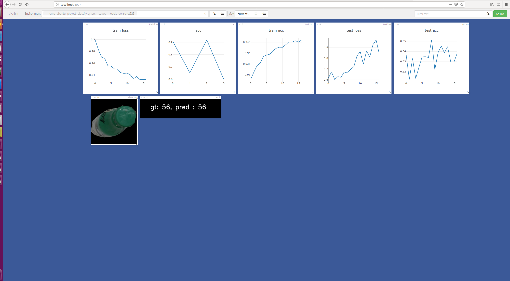

## simple classify model by pytorch
### How to use
* 1. write config (reference to **configs/classify2050c_densenet121.json**)
    * dataset store tree:
    * ```.
        └── datasets
            ├── classify_data
            │   ├── train
            │   │   ├── 1
            │   │   │   ├── 1_0.jpg
            │   │   │   ├── 1_10.jpg
            │   │   │   ├── 1_1.jpg
            │   │   │   ├── 1_2.jpg
            │   │   │   ├── 1_3.jpg
            │   │   │   ├── 1_4.jpg
            │   │   │   ├── 1_5.jpg
            │   │   │   ├── 1_6.jpg
            │   │   │   ├── 1_7.jpg
            │   │   │   ├── 1_8.jpg
            │   │   │   └── 1_9.jpg
            │   │   ├── 2
            │   │   │   ├── 2_0.jpg
            │   │   │   ├── 2_1.jpg
            │   │   │   ├── 2_2.jpg
            │   │   │   └── 2_3.jpg
            │   │   ├── 3
            │   │   │   ├── 3_0.jpg
            │   │   │   └── 3_1.jpg
    
       ```

    * this data path in config file is **/datasets/classify_data/train**
    * if your train data have multi-root-path you can write root paths as a list in config file 
* 2. `python train.py --config configs/classify2050c_densenet121.json`

### finished
* multi-GPUs support
* support backbones
    * resnet50, resnext50, resnext101
    * densenet121
    * se-resnext50 from [pretrained-models.pytorch](https://github.com/Cadene/pretrained-models.pytorch)
    * vgg
    * alexnet
    * squeezenet
* visual by visdom
 * 


### TODO
* more backbones support